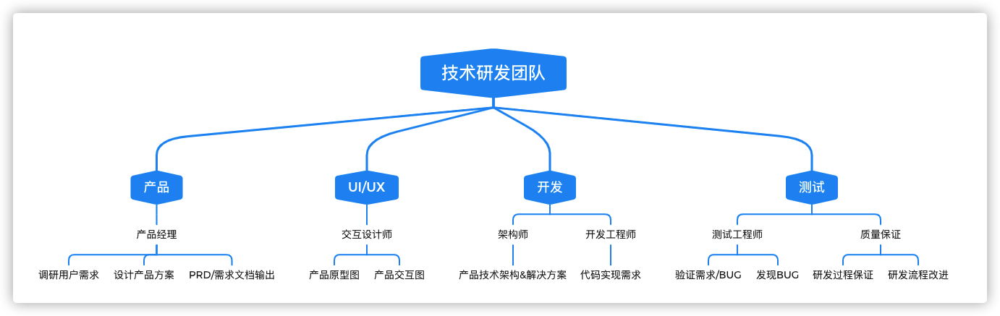
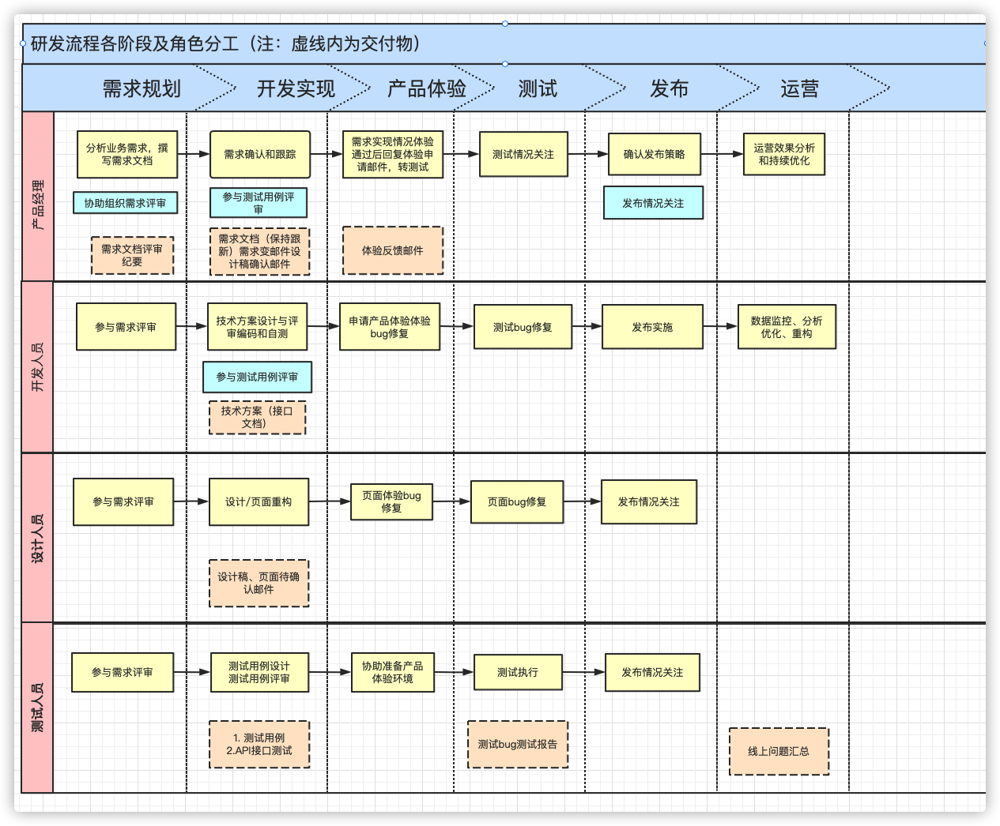

##  测试人员日常工作

测试人员主要关注和参与的内容：

- 需求评审
- 测试用例设计/评审
- 测试执行
- Bug生命周期追踪
- 线上问题追踪

## 实践中的一些使用方法

开发前/开发中/发布
- 有条理的澄清需求: 需求问题反馈和记录清单
- 总体进度追踪: 任务和进度安排
- 上线CheckList: 上线前准备
- 回归测试用例
- Bug总结和复盘
- 生产反馈的Bug复盘
- 文档模版化
  - 需求文档
  - Figma
  - 测试用例
  - 测试报告
  - Bug总结和复盘
  - 发布问题总结
  - 生产问题复盘

## CI/CD

- 流程各不同
- 减少复杂度
  - 代码
  - 配置
  - 数据库
  - 预处理数据
