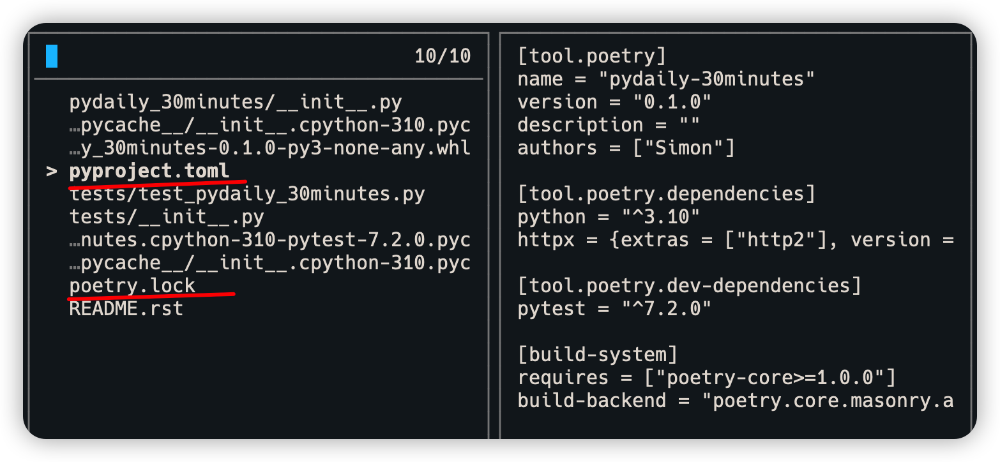

##  Poetry-Python 打包和依赖管理工具

--- 

## 原则

> 内容哪里来：
  - 内容基本都来官方文档和自己的实践总结
  - 介绍的东西确实好用和实用

> 能带来什么:
  - 给您带来的: 花最少的时间掌握最常用的东西
  - 性价比高：学习成本不高 VS 收获不少
--- 

## Poetry是什么


- https://python-poetry.org/

---

## Python项目管理

- 创建虚拟环境
- 使用requirements.txt
  ```sh
    pip install <name> 
    pip freeze -r \
      > requirements.txt
  ```
- setup.py打包

---

## Poetry的好处

- 集成了上面所有功能
- 统一管理依赖和打包
- 方便使用的命令行工具
- 可以集成shell 命令自动完成功能

---

## Poetry创建项目

```python
poetry new pydaily
tree pydaily
```


---

## Poetry 虚拟环境
```sh
poetry shell
```


--- 

## Poetry 添加依赖

  ```
  poetry add requests
  poetry add pytest -D
  ```


--- 

## Poetry 项目文件

- pyproject.toml: 项目依赖，打包发布生声明
- poetry.lock: 确定项目安装内容
- 类似于Javascript的:
  - package.json
  - package.lock

---

## Poetry: pyporject.toml



--- 

## Poetry 常用命令

- poetry add : 添加依赖
- poetry install: 安装你的代码-pip install
- poetry update: 更新所有依赖
- poetry run: 运行命令
- poetry build: 打包
- poetry publish: 发布包
  
---

## Poetry使用的好处

- 集成python从虚拟环境，第三方依赖，打包和发布功能
- 一个工具搞定所有项目配置
- 使用和其他语言理念一致
  * npm package.json
  * maven/gradle: pom.xml/build.gradle
  * go: go.mod
---

## Poetry 依赖管理 -- git 仓库管理

- 依赖可以是git仓库，本地文件

```toml
[tool.poetry.dependencies]
# Get the latest revision on the branch named "next"
requests = { git = "https://github.com/kennethreitz/requests.git", branch = "next" }
```
---

## Poetry 依赖管理 -- 从git安装

```sh
poetry add "https://github.com/myorg/mypackage_with_subdirs.git#subdirectory=subdir"
```

--- 

## Poetry  依赖管理 - 本地文件

```sh
[tool.poetry.dependencies]
# directory
my-package = { path = "../my-package/", develop = false }

# file
my-package = { path = "../my-package/dist/my-package-0.1.0.tar.gz" }
```

---

## Poetry 使用教程视频

- [无废话]Poetry-Python 打包和依赖管理工具](https://www.bilibili.com/video/BV1Ye4y1K7yH/?vd_source=c668c05f4b5039b3290cec826cf03f14)

## Q&A

- Demos
- Have a try and have fun

--- 
