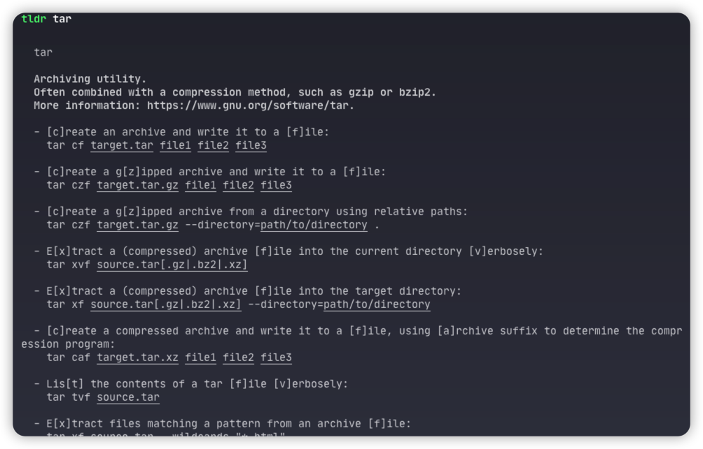

## tldr: too long; didn't read 

#### tldr 让阅读帮助不再痛苦和困难

--- 

## tldr 介绍

> tldr: too long; didn't read 

- tldr是什么？tldr是一个新帮助手册
- tldr解决什么问题？ 系统自带的帮助太长太难懂，tldr让你轻松理解

--- 

## tldr安装

```sh
npm install -g tldr
```

---

## tldr使用

- tldr更新cache 帮助文档

```sh
tldr update
```
---

## tldr - 简单直接



--- 

## 例子: pytest的帮助

---

