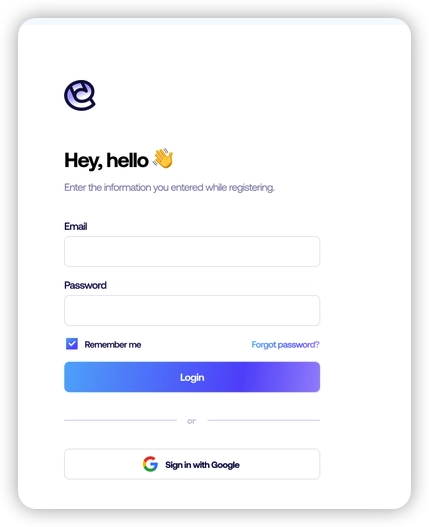
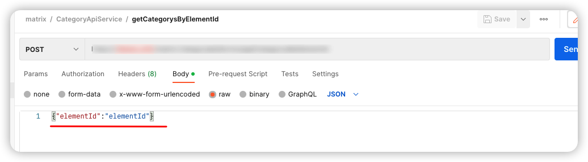

# Morden frontend-backend system

Morden Frontend-Backend system intro for QA.

---

## Agenda

- What's Frontend
- What's Backend
- How Frontend and Backend interact
  
---

## Frontend - UI Layer

What's Frontend doing: 
- Looks:
  - Layout/UI Component
  - Style: CSS
- UI Operation design: 
  - Interaction design/user friendly
  - How to compose different component in a user friendly manner
- Bridge of User input and Server data
  - Retrieving data from server to give user information
  - Sending user input to server from computing
- Frontend means interact with user directly
  
---

## Backend

What's Backend Doing:
- Feed Data
- Computing income data, keeping data updated

---

## How Frontend and Backend interact

1. User requests data from backend through Frontend(client side)
2. Frontend to design UI workflow to build request data input
3. Backend receive request to compute and return the result
4. To simplify, frontend build request dat to send to backend, backend compute these data to keep data updated and return the result to user.
---

## How Frontend and Backend interact


But sometimes it is really hard/boring to build request data, so use UI to 
let user input data step by step. The UI is fancy, and User is happy.

---

## Frontend UI VS Postman API

In Data Perspective, they are doing the same thing but with UI, it is more easy to use

- UI Login 


- Send API Login in POSTMAN

---

## API: A Contract between Frontend and Backend

- API:  Contracts/Functions define the input and output
- Data Interaction based on API
- So API Definition first? Why, to decouple the dependency between frontend and backend

---

## API: Design


## API: Code-Generation Based on API Design

ToDo API example: Springboot project
```sh
openapi-generator-cli generate -i 1-definition/openapi3-todo.yaml -g spring  --skip-validate-spec  -o todo-java
```

---

## Do you implementation

- Frontend
- Backend
