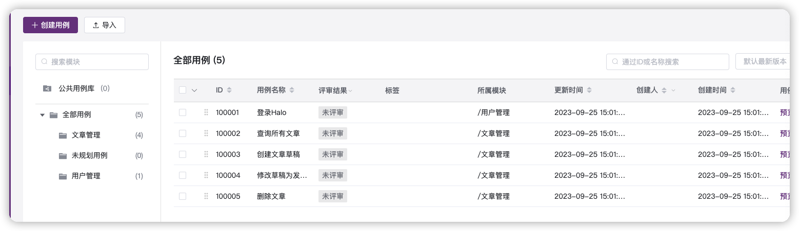
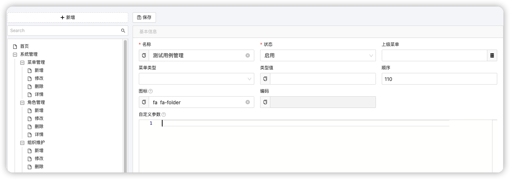
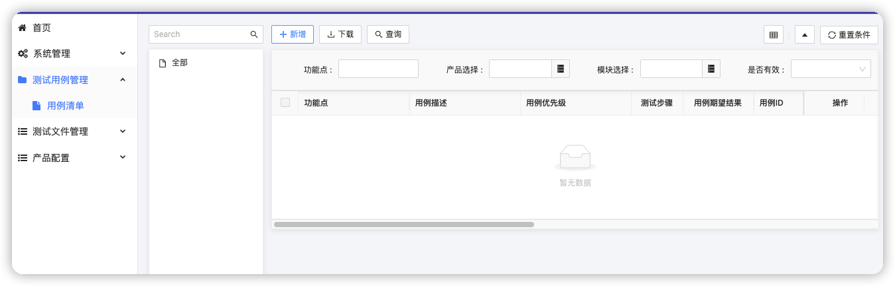
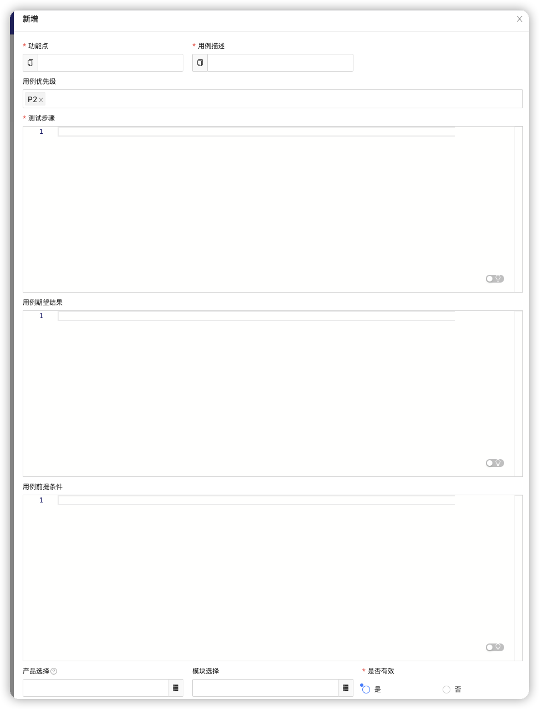

# Test Case - CRUD

- Define Test Case Model
- Config Test Case Menu

## 参考

Metershere 目前测试管理中一下子可以看到的功能:




功能主要为:
1. 添加/删除/修改测试用例
2. 绑定测试用例到产品，模块，或者标签等

如果完成以上功能，看起来不是那么容易，但是如果动手做起来其实还好.
下面展示一下如果进行最简单的实现.

## Define Test Case Model

定义TestCase的模型:

```java
@Entity
@Erupt(name = "测试用例",
        power = @Power(export = true),
        orderBy = "TestCase.updateTime desc",
        linkTree = @LinkTree(field = "product"))
@Table(name = "test_cases")
public class TestCase extends ProductModuleValidFlagVo {

    @EruptField(
            views = @View(
                    title = "功能点"
            ),
            edit = @Edit(
                    title = "功能点",
                    type = EditType.INPUT, search = @Search, notNull = true
            )
    )
    private String feature;
    @EruptField(
            views = @View(
                    title = "用例描述"
            ),
            edit = @Edit(
                    title = "用例描述",
                    type = EditType.INPUT, notNull = true
            )
    )
    private String summary;

    @EruptField(
            views = @View(
                    title = "用例优先级"
            ),
            edit = @Edit(
                    title = "用例优先级",
                    type = EditType.TAGS,
                    tagsType = @TagsType(
                            fetchHandler = SqlTagFetchHandler.class,
                            fetchHandlerParams = "select distinct priority from  test_cases"
                    )
            )
    )
    private String priority = "P2";


    @EruptField(
            views = @View(
                    title = "测试步骤"
            ),
            edit = @Edit(
                    title = "测试步骤",
                    type = EditType.CODE_EDITOR, notNull = true,
                    codeEditType = @CodeEditorType(language = "text")
            )
    )
    private String steps;
    @EruptField(
            views = @View(
                    title = "用例期望结果"
            ),
            edit = @Edit(
                    title = "用例期望结果",
                    type = EditType.CODE_EDITOR,
                    codeEditType = @CodeEditorType(language = "text")
            )
    )
    private String expectedResult;

    @EruptField(
            views = @View(
                    title = "用例ID"
            )
    )
    private String uuid;
    @EruptField(
            views = @View(
                    title = "用例前提条件"
            ),
            edit = @Edit(
                    title = "用例前提条件",
                    type = EditType.CODE_EDITOR,
                    codeEditType = @CodeEditorType(language = "text")
            )
    )
    private String precondition;
}
```

## 菜单配置

1. 运行应用
2. 进行菜单配置,就可以基本完成以上功能




## 配置完成之后展示




